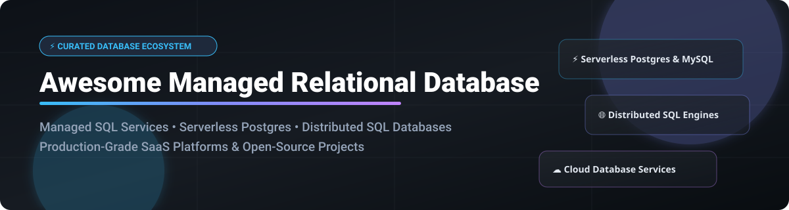

  

# 🚀 Awesome Managed Relational Database 🗄️

  
  
  
  
  

> 🌟 **A Curated List of SaaS Products & Open-Source GitHub Projects**
> ⚡ **Focused on Managed SQL, Serverless Postgres, Distributed SQL & Cloud Database Services**

📅 **Last updated:** October 2026

---

## 🔍 Overview & Ecosystem Analysis

This repository tracks production-grade **Managed Relational Databases (RDBMS)**, covering **DBaaS (Database-as-a-Service)**, **Serverless SQL**, **Cloud-Native Databases**, and **Distributed SQL Engines**. These solutions empower backend engineers, platform teams, database administrators (DBAs), and cloud architects to run scalable, highly available SQL databases without managing physical servers, manual backups, or complex replication topologies.

### 📈 Market Size & Industry Dynamics

- 📊 **Estimated Market Size:** The global managed relational database market is valued at **~$30 Billion in 2026** and is projected to expand toward **~$70 Billion by 2032**, driven by cloud migration, serverless database adoption, and real-time analytical workloads.
- 🏢 **Market Concentration & Structure:** The sector is **moderately concentrated at the top tier** (dominated by hyperscalers like AWS RDS, Azure SQL, and Google Cloud SQL), but **highly fragmented in the emerging serverless and distributed SQL segments**. Rather than a single "winner-take-all" monopoly, specialized platforms (e.g., Supabase, Neon, PlanetScale, CockroachDB) successfully capture high-growth niches by offering instant branching, separation of compute and storage, and global multi-region consistency.

---

## 📖 Table of Contents

- [☁️ SaaS / Hosted Platforms](#️-saas--hosted-platforms)
- [🔓 Open-Source GitHub Projects](#-open-source-github-projects)
- [🤝 How to Contribute](#-how-to-contribute)
- [💖 Support & Sponsorship](#-support--sponsorship)
- [⚠️ Disclaimer](#️-disclaimer)
- [📈 Star History](#-star-history)

---

## ☁️ SaaS / Hosted Platforms

Below is a comparative breakdown of top commercial DBaaS and managed cloud relational database services:

| 🏢 Platform | 📝 Description | 💰 Pricing (Starting Tier) | 🎁 Free Tier / Trial Limits | 📊 Company Size (Revenue / Valuation) |
| :--- | :--- | :--- | :--- | :--- |
| **🟧 Amazon RDS** | AWS's managed relational database service supporting PostgreSQL, MySQL, MariaDB, Oracle, SQL Server, and Db2. | 💵 `db.t4g.micro` starting at ~$12/month | 🎁 750 hours/month of `db.t2.micro`/`db.t3.micro` for 12 months (AWS Free Tier) | 🏢 ~$638B revenue (Amazon FY2025) |
| **⚡ Amazon Aurora** | AWS's cloud-native high-performance relational database compatible with PostgreSQL and MySQL. | 💵 `db.t4g.medium` starting at ~$59.86/month; Serverless v2 at $0.12/ACU-hour | 🎁 Aurora PostgreSQL 750 hours/month for 12 months on AWS Free Tier | 🏢 ~$638B revenue (Amazon FY2025) |
| **🔴 Google Cloud SQL** | Google's managed MySQL, PostgreSQL, and SQL Server with automatic backups, failover, and high availability. | 💵 `db-f1-micro` starting at ~$9/month | 🎁 $300 credit valid for 90 days (Google Cloud Free Trial) | 🏢 ~$350B revenue (Alphabet FY2025) |
| **🔵 Microsoft Azure SQL Database** | Microsoft's managed SQL Server engine offering serverless, DTU, and vCore purchasing models. | 💵 Basic tier starting at ~$5/month | 🎁 $200 credit for 30 days + 12 months of select free services (Azure Free Account) | 🏢 ~$281B revenue (Microsoft FY2025) |
| **🪳 CockroachDB Cloud** | Distributed SQL database with PostgreSQL wire compatibility and Spanner-inspired multi-region architecture. | 💵 Serverless pay-per-request starting at $0.10/10M Request Units + $0.25/GiB-month | 🎁 30-day free trial or existing legacy free tiers ($5/mo free credit) | 💎 ~$5B valuation ($633M raised) |
| **💚 Neon** | Serverless PostgreSQL platform featuring separated storage and compute, instant schema branching, and scale-to-zero. | 💵 Launch plan starting at $0.106/CU-hour ($5/month minimum) | 🎁 100 CU-hours/month, 0.5 GB storage per project | 📈 Part of Databricks (~$3.5B revenue est.) |
| **⚡ Supabase** | Open-source Firebase alternative providing managed PostgreSQL, Auth, Edge Functions, Vector search, and Realtime. | 💵 Pro plan starting at $25/month | 🎁 2 active projects, 500 MB database storage, 50k MAU | 💎 Private (~$2B valuation est.) |
| **🦀 Aiven** | Fully managed open-source database services across multi-cloud providers including PostgreSQL, MySQL, and Redis. | 💵 Developer tier starting at ~$19/month | 🎁 30-day free trial with $100 credits | 💎 Private (~$500M+ valuation est.) |
| **🚀 PlanetScale** | Serverless MySQL-compatible database platform built on Apache Vitess featuring non-blocking schema branching. | 💵 Scaler Pro plan starting at $39/month | 🎁 14-day free trial available | 💎 $105M raised ($3.9M revenue est.) |
| **⏰ Timescale Cloud** | Cloud PostgreSQL database optimized for time-series analytics, IoT metrics, financial data, and vector search. | 💵 Starting at $30/month for compute/storage instance | 🎁 30-day free trial with $300 credits | 💎 Private (Timescale, ~$100M+ valuation est.) |

---

## 🔓 Open-Source GitHub Projects

Curated open-source relational database management systems (RDBMS) sorted descending by GitHub_Stars_Count:

| 📦 Repo | 📝 Description | ⭐ GitHub_Stars |
| :--- | :--- | :--- |
| **[🐘 PostgreSQL](https://github.com/postgres/postgres)** | The world's most advanced open-source relational database. BSD license. ACID-compliant with MVCC and extensibility. |  |
| **[🐼 TiDB](https://github.com/pingcap/tidb)** | Open-source distributed HTAP database. MySQL-compatible with horizontal scaling and real-time transactional analytics. |  |
| **[🪳 CockroachDB](https://github.com/cockroachdb/cockroach)** | Distributed SQL database with PostgreSQL wire compatibility, resilience, and horizontal scaling. |  |
| **[🐘 YugabyteDB](https://github.com/yugabyte/yugabyte-db)** | High-performance distributed SQL database compatible with PostgreSQL. Built for cloud-native apps. |  |
| **[🐬 MySQL](https://github.com/mysql/mysql-server)** | The world's most popular open-source relational database. Powers global web infrastructure and enterprise applications. |  |
| **[🪶 SQLite](https://github.com/sqlite/sqlite)** | Lightweight, zero-configuration, self-contained embedded relational database engine deployed billions of times. |  |
| **[🦭 MariaDB](https://github.com/MariaDB/server)** | Community-driven fork of MySQL. Drop-in replacement featuring performance enhancements and storage engines. |  |
| **[🧱 openGauss](https://github.com/opengauss-mirror/openGauss-server)** | High-performance open-source enterprise relational database engine optimized for high-concurrency workloads. |  |
| **[⚡ rqlite](https://github.com/rqlite/rqlite)** | Lightweight, distributed relational database built on Raft consensus and SQLite engine. |  |
| **[🔥 Firebird](https://github.com/FirebirdSQL/firebird)** | Enterprise-grade open-source RDBMS offering lightweight resource footprint and high concurrency. |  |

---

## 🤝 How to Contribute

Contributions are welcome! Please follow these steps to add new managed database platforms or open-source SQL projects:

1. 🍴 Fork the repository.
2. ✏️ Update `README.md` following the exact table structure and badge format.
3. 📥 Submit a Pull Request (PR) with a clear summary of changes.

---

## 💖 Support & Sponsorship

Thank you for exploring **Awesome Managed Relational Database**! If you find this curated list helpful for your database research, backend stack evaluation, or cloud architecture planning, please consider supporting the project:

- ⭐ **Star this repository** to help others discover it!
- 🔀 **Fork & Share** it with your fellow engineers, DBAs, and developer communities.
- ☕ **Buy me a coffee / Sponsor:** If you'd like to support ongoing open-source curation and maintenance, feel free to sponsor via the [GitHub Sponsor Dashboard](https://github.com/sponsors/ishandutta2007).

---

## ⚠️ Disclaimer

🔒 This repository is a community-curated list for informational and educational purposes only. It does not constitute commercial endorsement. Managed relational database services process critical application data; always verify security features, data residency, encryption standard compliance, and backup protocols before production deployment.

---

## 📈 Star History

